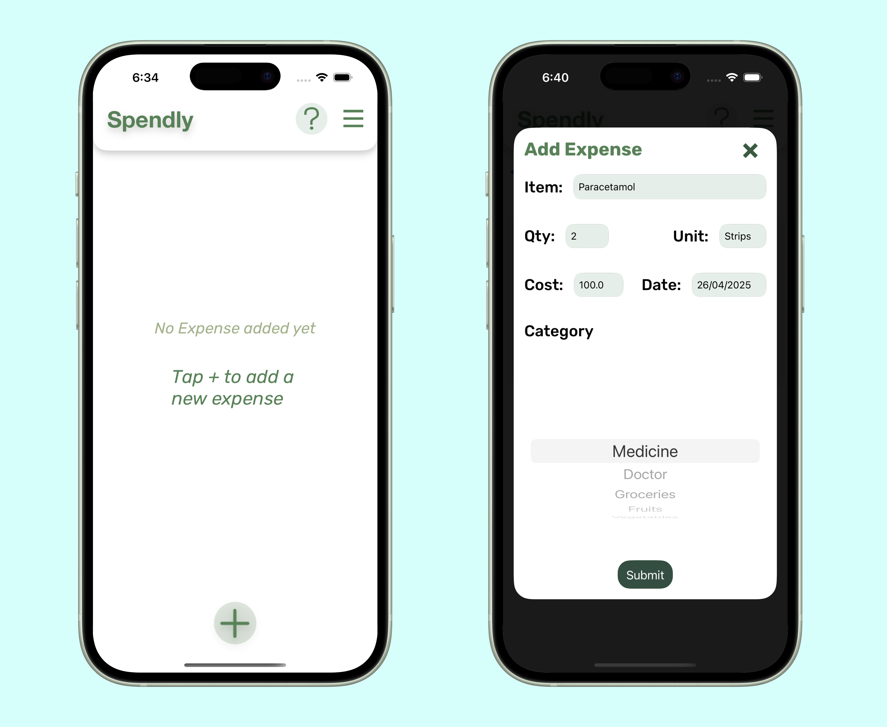
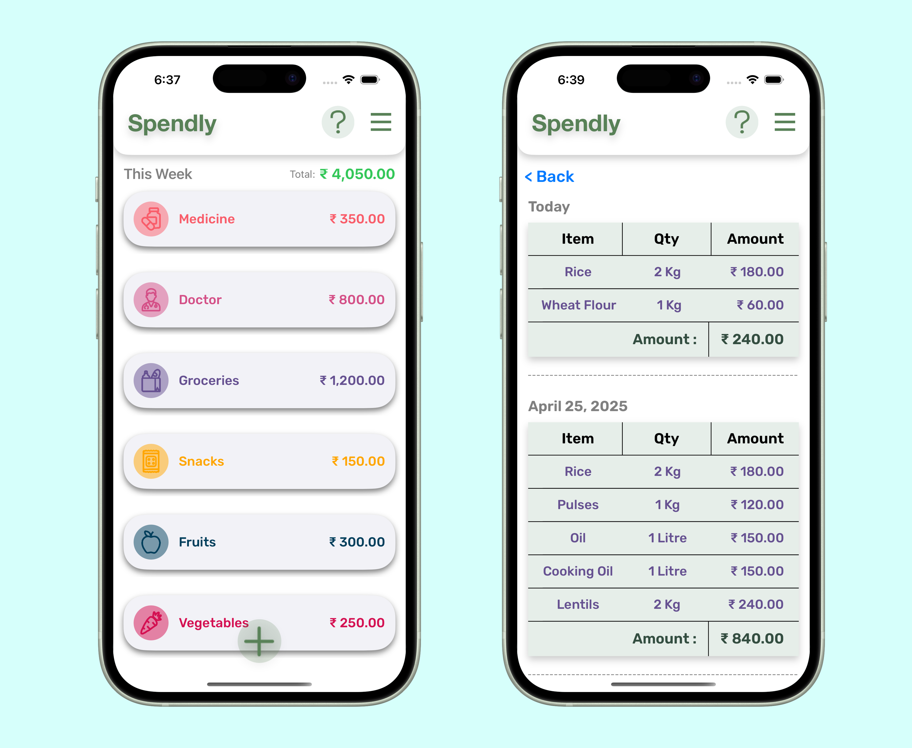

# 📒 Expense Tracker

An iOS app that helps you track your daily and weekly expenses easily by category. View weekly summaries, drill down into daily details, and manage your spending with a clean and simple interface.

---

## ✨ Features

- 🗂 Categorized Expense Tracking  
- 📅 View Weekly Consolidated Expenses  
- 📆 Drill Down to Daily Expenses per Category  
- ➕ Add, Edit, and Delete Expense Items  
- 🎨 Color-Coded Categories for Quick Identification  
- 📊 Simple and Intuitive User Interface  
- 🔄 Real-time Updates between Views  

---

## 🛠 Tech Stack

- Swift
- UIKit
- XIBs for Custom Views
- MVC Architecture

---

## 🧩 App Structure

- **HomeViewController**  
  Displays weekly total expenses grouped by category.

- **CategoricalExpenseViewController**  
  Shows daily expenses for a selected category.

- **NavBarViewController**  
  Custom navigation bar controller to manage title and add button actions consistently across views. 

- **Expense Model**  
  Represents individual expense entries (category, item, quantity, price, date, etc).

---
## 🎨 Design

The app design was fully planned and created using Figma.  
You can view the full design file here: [View Figma Design](https://www.figma.com/design/e0YXSTD06akfGFBCSfOZMK/Expense-Tracker?node-id=0-1&t=Im3zjA9g6YqttZeJ-1)

---

## 🖼 Screenshots

### 🏠 Home Page and Add Expense Modal

### 📅 Categorical and Daily Expenses View

---

## 📄 License
This project is licensed under the MIT License. [See License](https://github.com/Sampada0808/ExpenseTracker/blob/main/LICENSE.md) for more details
